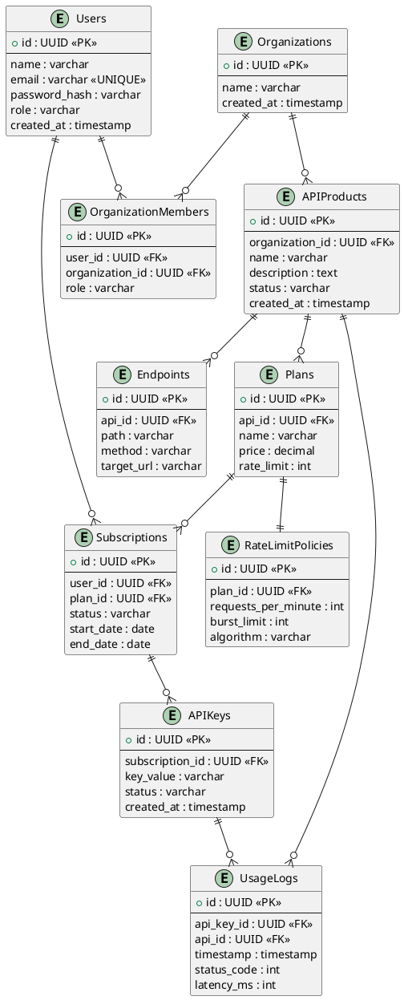

# ER Diagram — FakeKong 2.0

## Overview

The Entity Relationship (ER) diagram represents the database schema of the FakeKong 2.0 platform. It illustrates the relationships between users, organizations, API products, subscriptions, API keys, and usage logs.

The system follows a multi-tenant architecture where multiple organizations can manage APIs and developers can subscribe to API plans using generated API keys. The database is designed using relational modeling principles to ensure data integrity, scalability, and efficient querying.

The schema is implemented using PostgreSQL.

---

## Key Entities

* **Users** — Platform users including developers and administrators.
* **Organizations** — Multi-tenant workspaces that own APIs.
* **OrganizationMembers** — Mapping between users and organizations.
* **APIProducts** — APIs published by organizations.
* **Endpoints** — Individual API routes under each API product.
* **Plans** — Subscription plans with pricing and rate limits.
* **Subscriptions** — User subscriptions to API plans.
* **APIKeys** — Authentication keys issued for subscriptions.
* **RateLimitPolicies** — Rate limiting rules associated with plans.
* **UsageLogs** — Logs capturing API usage and performance metrics.

---

## ER Diagram

---

## Design Considerations

The database design ensures:

* Multi-tenant isolation through organization relationships.
* Secure API access via API keys linked to subscriptions.
* Flexible subscription management using plans.
* Scalable logging through usage logs.
* Support for rate limiting using policy definitions.

Foreign key constraints maintain referential integrity between entities.

---

## Conclusion

The ER diagram models the core data architecture of FakeKong 2.0, supporting API management, subscription workflows, authentication, and analytics. It provides a scalable foundation for implementing a distributed API gateway and developer marketplace platform.

