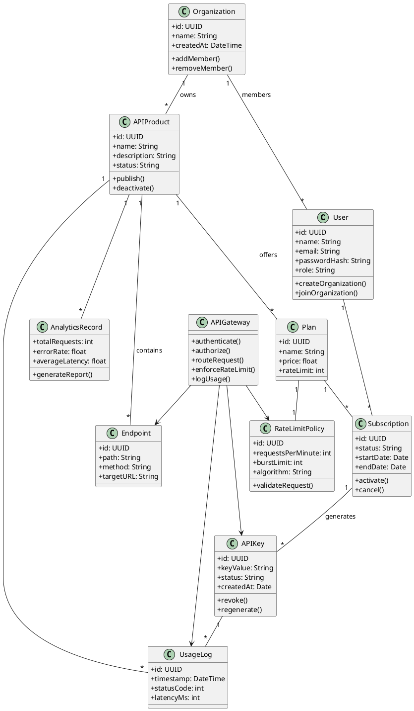

# Class Diagram — FakeKong 2.0

## Overview

The class diagram represents the core object-oriented structure of the FakeKong 2.0 platform. It illustrates the main domain entities, their attributes, methods, and relationships within the system.

The system follows object-oriented design principles such as encapsulation, abstraction, and separation of concerns. The diagram models key components including users, organizations, APIs, subscriptions, API keys, rate limiting, and gateway processing.

This class structure supports a modular backend architecture aligned with software engineering best practices.

---

## Key Classes

* **User** — Represents platform users including developers and administrators.
* **Organization** — Multi-tenant workspace containing APIs and members.
* **APIProduct** — Represents an API published by an organization.
* **Endpoint** — Individual routes belonging to an API.
* **Plan** — Subscription plan with pricing and rate limits.
* **Subscription** — User subscription to an API plan.
* **APIKey** — Authentication key issued to access APIs.
* **RateLimitPolicy** — Defines rate limiting rules for API usage.
* **UsageLog** — Stores request logs and metrics.
* **AnalyticsRecord** — Aggregated analytics data.
* **APIGateway** — Core gateway responsible for request processing.

---

## Class Diagram

---

## Object-Oriented Principles Applied

The system demonstrates core OOP concepts:

* **Encapsulation** — Each class contains its own attributes and methods.
* **Abstraction** — Gateway and service behaviors hide implementation details.
* **Association** — Relationships between users, subscriptions, and APIs.
* **Composition** — API products contain endpoints.
* **Separation of Concerns** — Domain entities are independent of gateway logic.

---

## Design Patterns Reflected

The class design aligns with several software design patterns:

* Repository Pattern — Data access abstraction
* Service Layer Pattern — Business logic separation
* Factory Pattern — API key generation
* Strategy Pattern — Rate limiting algorithms
* Middleware Pattern — Gateway request pipeline
* Singleton Pattern — Configuration management

---

## Conclusion

The class diagram provides a structured view of the FakeKong 2.0 domain model and demonstrates object-oriented system design. It serves as the foundation for implementing a scalable API gateway and developer marketplace platform using modern backend engineering practices.

