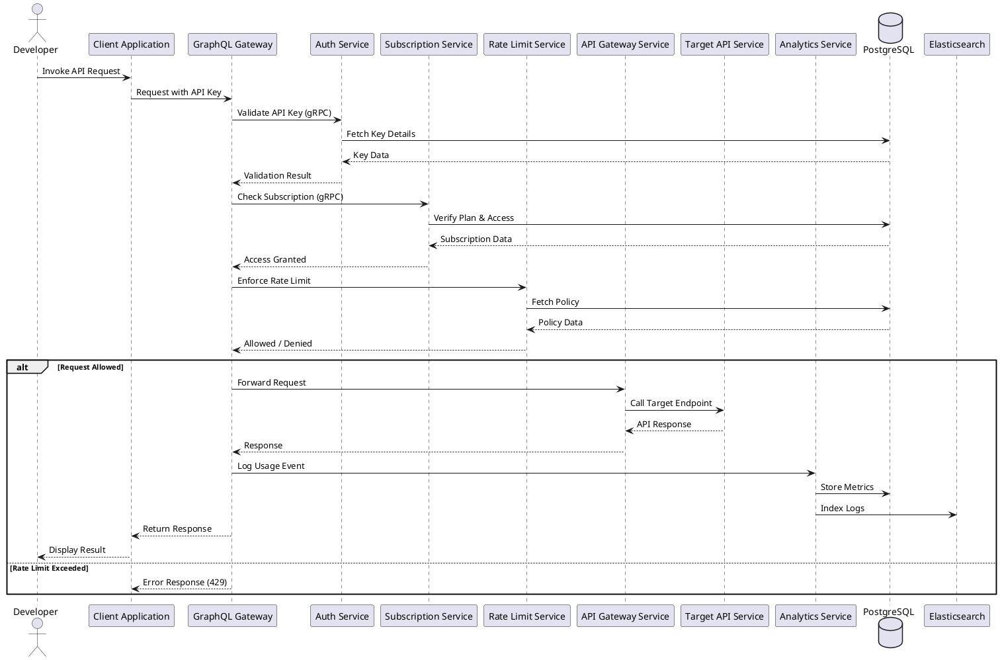

# Sequence Diagram — FakeKong 2.0

## Overview

The sequence diagram illustrates the interaction flow between system components when a developer invokes an API through the FakeKong platform. It demonstrates the request lifecycle including authentication, subscription validation, rate limiting enforcement, request routing, and analytics logging.

The system follows a distributed architecture where a gateway layer communicates with backend services using gRPC, while persistent data is stored in PostgreSQL and logs are indexed in Elasticsearch.

---

## Scenario: API Invocation via Gateway

The main sequence shown represents the following workflow:

1. A developer sends an API request using an API key.
2. The request passes through the GraphQL/Gateway layer.
3. Authentication and subscription validation are performed.
4. Rate limiting policies are enforced.
5. The request is routed to the target API service.
6. Usage data is logged for analytics and monitoring.
7. The response is returned to the developer.

This flow highlights the backend orchestration and service communication within the system.

---

## Sequence Diagram

---

## Design Considerations

The sequence diagram demonstrates several important architectural aspects:

* Gateway-based request orchestration
* Service-to-service communication using gRPC
* Authentication and authorization workflow
* Rate limiting enforcement using policies
* Logging and analytics pipeline
* Separation of concerns across services

The design ensures scalability, maintainability, and secure API access.

---

## Conclusion

The sequence diagram provides a dynamic view of how components interact within FakeKong 2.0 during API invocation. It highlights the distributed system architecture and backend coordination required to enforce security, rate limits, and monitoring while processing client requests.

