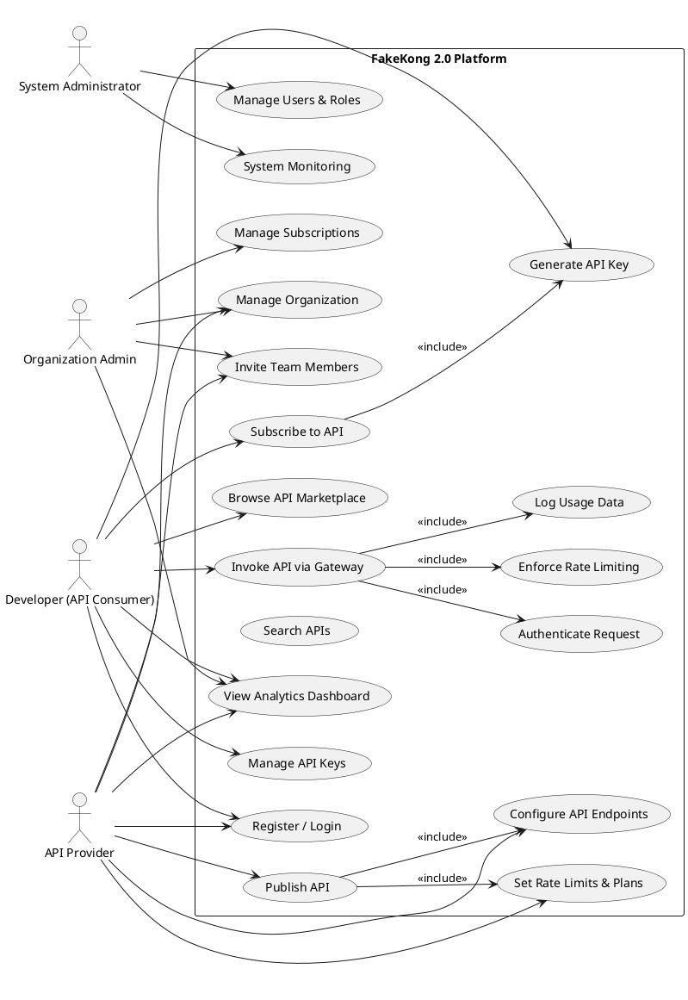

# Use Case Diagram — FakeKong 2.0

## Overview

The use case diagram illustrates the interactions between different actors and the FakeKong 2.0 platform. It represents the functional requirements of the system and shows how users interact with various components such as API publishing, subscription management, API gateway access, and analytics.

The platform supports multiple stakeholders including developers, API providers, organization administrators, and system administrators in a multi-tenant environment.

---

## Actors

* **Developer (API Consumer)** — Subscribes to APIs and invokes them using API keys.
* **API Provider** — Publishes and manages APIs within an organization.
* **Organization Admin** — Manages users, subscriptions, and organization settings.
* **System Administrator** — Oversees system-level monitoring and management.

---

## Major Functionalities

* User authentication and registration
* Organization and team management
* API publishing and configuration
* API subscription and key generation
* API gateway invocation with authentication and rate limiting
* Usage analytics and monitoring
* System administration and user management

---

## Use Case Diagram

---

## Design Considerations

The use case diagram reflects:

* Multi-tenant SaaS architecture
* Separation of roles and responsibilities
* Secure API access through authentication and rate limiting
* Subscription-based API consumption
* Monitoring and analytics capabilities

The diagram ensures clarity in system functionality and actor interactions.

---

## Conclusion

The use case diagram provides a high-level functional view of the FakeKong 2.0 platform, illustrating how different actors interact with the system to publish, manage, and consume APIs. It serves as a foundation for system design and implementation planning.

